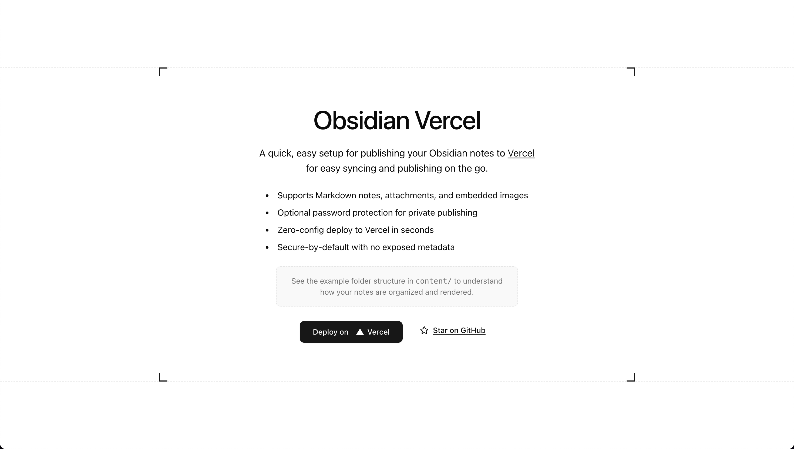

# Obsidian-vercel

A quick, easy setup for publishing your Obsidian notes to [Vercel](https://vercel.com) for easy syncing and publishing on the go.

## Setup

1. Clone this repository
2. Add your Obsidian notes to the `content` directory (if you have images or attachments, rename them to...)
3. Deploy to Vercel

That's all!

